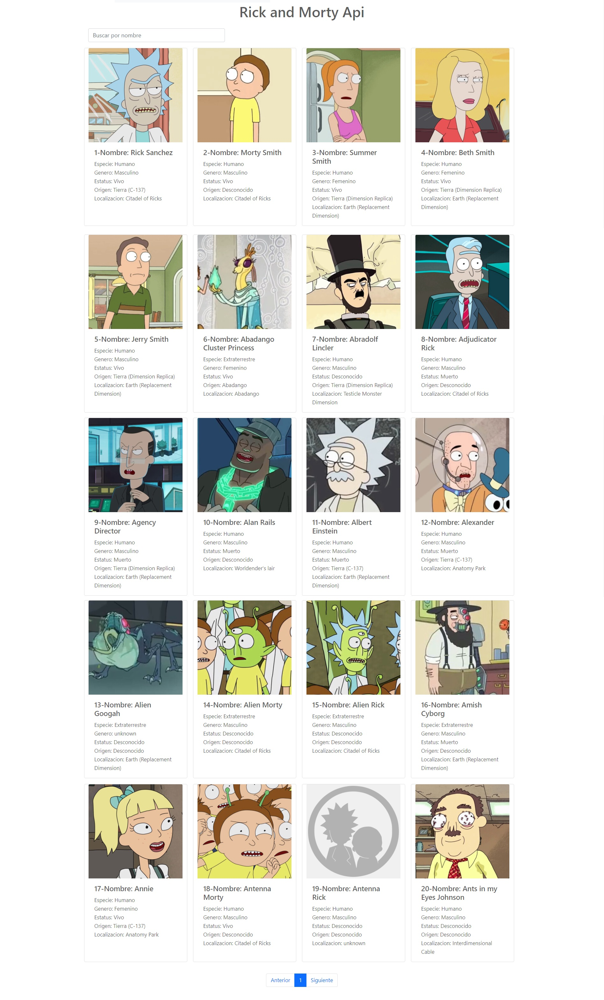

# RickyMortyApi



Esta plantilla fue creada en Vue3 Y Vite haciendo uso de fetch para optener resultados de la api de Rick y Morty.

## Link de ejemplo
https://rickandmortyosulaa.netlify.app/

## Configuración IDE recomendada

[VSCode](https://code.visualstudio.com/) + [Volar](https://marketplace.visualstudio.com/items?itemName=Vue.volar) (Vetur) + [TypeScript Vue Plugin (Volar)](https://marketplace.visualstudio.com/items?itemName=Vue.vscode-typescript-vue-plugin).

## Configuración personalizada

Véase [Referencia de configuración de Vite](https://vitejs.dev/config/).

## Configuración del proyecto

```sh
npm install
```

### Compilar y cargar en caliente para el desarrollo

```sh
npm run dev
```

### Compilar y minificar para producción

```sh
npm run build
```

### Lint con [ESLint](https://eslint.org/)

```sh
npm run lint
```
